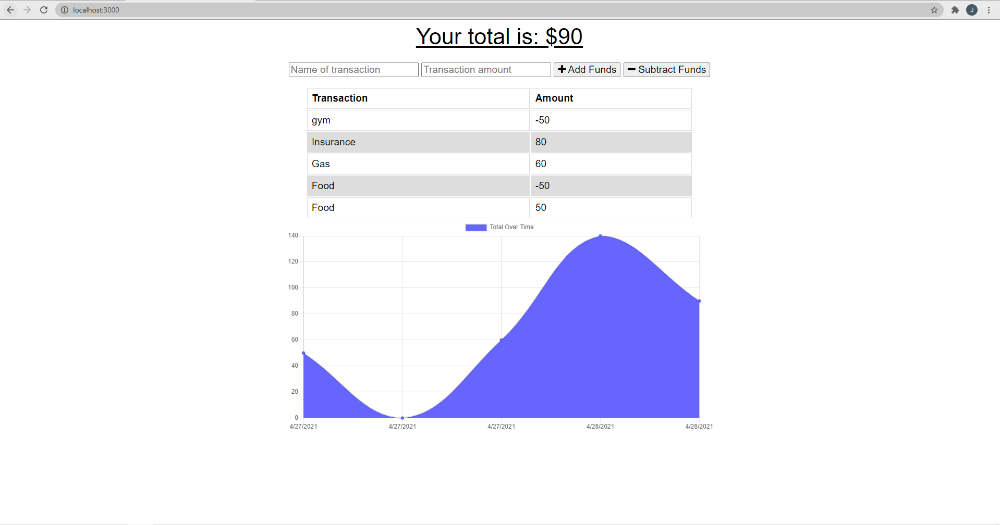

## Table of Contents

- Link
- Description
- Installation
- Questions

## You-budget!

Follow the link below to try out the application for yourself! Let the gains begin!

[https://stark-savannah-23016.herokuapp.com/](https://stark-savannah-23016.herokuapp.com/)

## Do you need to keep track of your budget?

Do you have issues keeping up with you budget? With You-budget, you can keep track of you finances even if your offline! With this simple app, you can 

## Installation instructions

For this application, you will need to first run npm i to install the dependencies which include express, mongoose for the server and morgan. Once the dependencies have been installed, run the seed package by typing in npm run seed in the terminal. Then the user will run npm run start to run the local server. 

## Questions?

If you have any questions or concerns, please feel free to reach out to me with the contact information provided below. Any suggestions are greatly appriciated!

- [josephguajardo@ymail.com](josephguajardo@ymail.com)

- [jagg1991](jagg1991).

